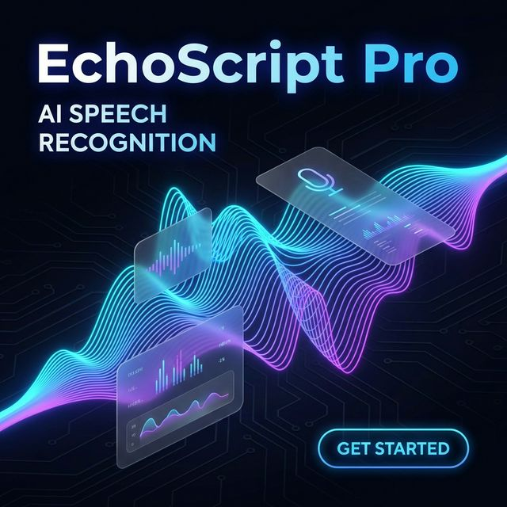

# EchoScript Pro: Advanced Pronunciation AI 🎙️



EchoScript Pro is a modern, high-performance speech-to-text application designed for pronunciation analysis and transcription. It uses the state-of-the-art **Wav2Vec2** model from Meta (Facebook AI) to provide accurate results with a premium Streamlit interface.


## ✨ Features
- **Premium UI**: Glassmorphism design with responsive elements.
- **High Accuracy**: Powered by `facebook/wav2vec2-large-960h-lv60-self`.
- **Direct Processing**: No external API required; everything runs locally.
- **Audio Support**: Handles MP3, WAV, M4A, and OGG files via FFmpeg.

## 🚀 Getting Started

### Prerequisites
- Python 3.8+
- [FFmpeg](https://ffmpeg.org/) (Project expects FFmpeg binaries in `ffmpeg-8.0-essentials_build/bin/`)

### Installation

1. **Clone the repository**:
   ```bash
   git clone https://github.com/AHAD2911/Advanced-Pronunciation-AI-
   cd stt5
   ```

2. **Set up a virtual environment**:
   ```bash
   python -m venv .venv
   .\.venv\Scripts\Activate.ps1  # Windows
   # source .venv/bin/activate  # Linux/Mac
   ```

3. **Install dependencies**:
   ```bash
   pip install -r requirement.txt
   ```

### Running the App
Launch the Streamlit dashboard:
```bash
streamlit run streamlit_app.py
```

## 🛠️ Tech Stack
- **Frontend**: Streamlit (with custom CSS)
- **AI Model**: Wav2Vec2 CTC (HuggingFace Transformers)
- **Audio Engine**: Librosa & FFmpeg
- **Backend Core**: PyTorch

---
Designed by AHAD2911
